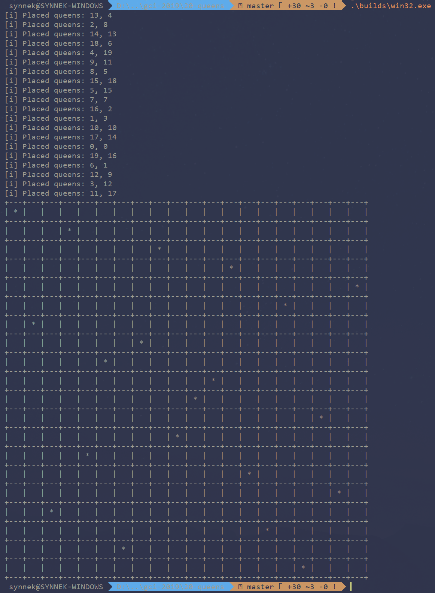

# 20 Queens
## Script to solve [Eight Queen Puzzle](https://en.wikipedia.org/wiki/Eight_queens_puzzle) challange.
By default, script tries to put 20 queens on 20x20 board, but you can change that by modyfing `TABLE_WIDTH`, `TABLE_HEIGHT` and `QUEENS` consts inside `main.cpp` and recompiling it.

### Prebuilt binaries are inside `bulds/` directory
- Windows x64
- Linux x64

### Demo

### Made by Emilian **SynneK1337** Zawrotny