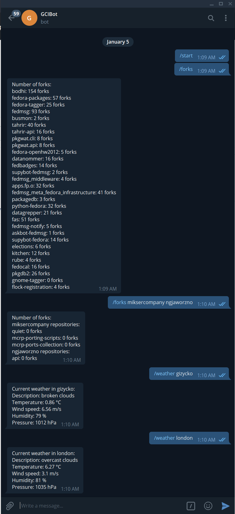

# Telegram Bot
## Commands:
- `/forks` shows amount of forks for every repo in providen organization (defualt org: [fedora-infra](https://github.com/fedora-infra))
- `/weather` shows weather in providen location

## Dependencies used:
- [requests](https://pypi.org/project/requests/)
- [python-telegram-bot](https://python-telegram-bot.org/)

## Screenshots:

### Made by Emilian **SynneK1337** Zawrotny