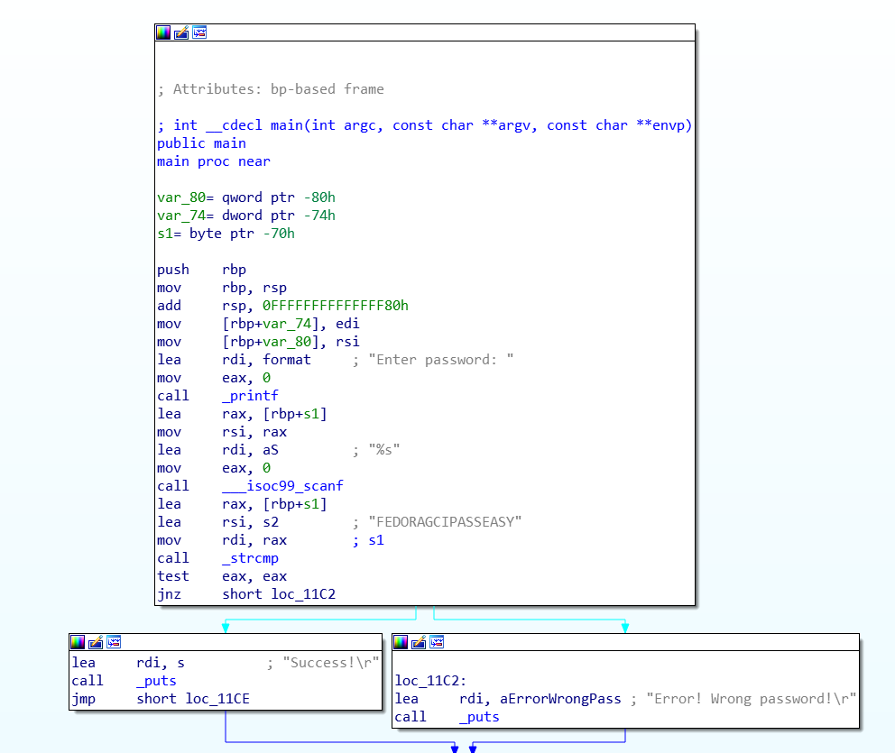
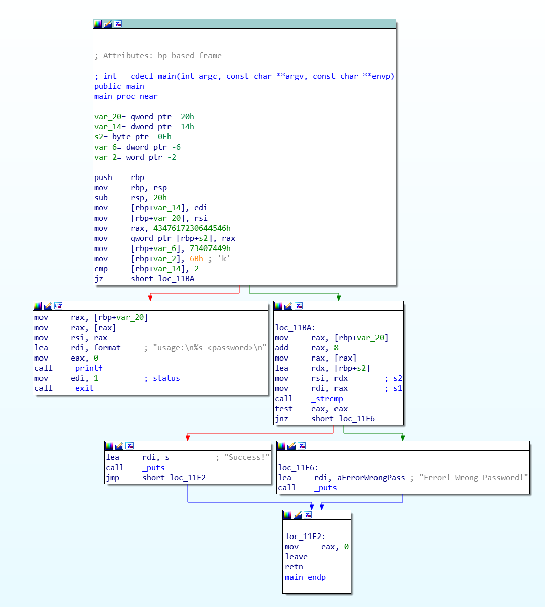

# Reverse Engineering to extract password from binary files
## Google Code-In 2019 Challange by Fedora Organizaiton
Challange comes to us with 3 binary files called: `1stcrackme`, `2ndcrackme` and `3rdcrackme`.
All of them are ELF64 files for x86_64 CPU Architecture.

## Breaking `1stcrackme`
After execution, the binary asks us to enter a password three times and exit.
My first idea was use `strings` tool and it gave me following output:
```
/lib64/ld-linux-x86-64.so.2
libc.so.6
__isoc99_scanf
puts
printf
__cxa_finalize
strcmp
__libc_start_main
GLIBC_2.7
GLIBC_2.2.5
_ITM_deregisterTMCloneTable
__gmon_start__
_ITM_registerTMCloneTable
u/UH
[]A\A]A^A_
Enter password:
FEDORAGCIPASSEASY
Success!
Error! Wrong password!
0x1337
0x133337
;*3$"
GCC: (Debian 9.2.1-19) 9.2.1 20191109
crtstuff.c
deregister_tm_clones
__do_global_dtors_aux
completed.7447
__do_global_dtors_aux_fini_array_entry
frame_dummy
__frame_dummy_init_array_entry
02.c
__FRAME_END__
__init_array_end
_DYNAMIC
__init_array_start
__GNU_EH_FRAME_HDR
_GLOBAL_OFFSET_TABLE_
__libc_csu_fini
_ITM_deregisterTMCloneTable
puts@@GLIBC_2.2.5
_edata
printf@@GLIBC_2.2.5
__libc_start_main@@GLIBC_2.2.5
__data_start
strcmp@@GLIBC_2.2.5
__gmon_start__
__dso_handle
_IO_stdin_used
__libc_csu_init
__bss_start
main
__isoc99_scanf@@GLIBC_2.7
__TMC_END__
_ITM_registerTMCloneTable
__cxa_finalize@@GLIBC_2.2.5
.symtab
.strtab
.shstrtab
.interp
.note.gnu.build-id
.note.ABI-tag
.gnu.hash
.dynsym
.dynstr
.gnu.version
.gnu.version_r
.rela.dyn
.rela.plt
.init
.plt.got
.text
.fini
.rodata
.eh_frame_hdr
.eh_frame
.init_array
.fini_array
.dynamic
.got.plt
.data
.bss
.comment
```
And as you can see, there are a few intresting strings below **Enter password** phrase: `FEDORAGCIPASSEASY`, `0x1337`, `0x133337`.
So, with those strings, I received thee **Success!** messages.
```
Enter password: FEDORAGCIPASSEASY
Success!
Enter password: 0x1337
Success!
Enter password: 0x133337
Success!
```
Also, you could use IDA to crack this down. Graph view clearly shows the passwords.


## Breaking `2ndcrackme`
After execution of `2ncrackme` I got instruction how to execute this app properly:
```
usage: ./2ndcrackme <password>
```

I opened the binary in [IDA](https://www.hex-rays.com/products/ida/) and it showed me following flow graph:



As we can see, before printing **Success!**/**Error! Wrong Password!** it is comparing two strings:
- `[rbp+var_20]` which is password providen by us
- `[rbp+s2]` which is password hard-coded into a program

Then, I decided to run binary inside [GDB](https://www.gnu.org/software/gdb/)
I put breakpoint at start of `main` function using ```break *main```
and then I ran the program using ```run password```
After execution, I disassembled main function using ```disassemble main``` and I got following output:
```
Dump of assembler code for function main:
=> 0x0000000008001165 <+0>:     push   %rbp
   0x0000000008001166 <+1>:     mov    %rsp,%rbp
   0x0000000008001169 <+4>:     sub    $0x20,%rsp
   0x000000000800116d <+8>:     mov    %edi,-0x14(%rbp)
   0x0000000008001170 <+11>:    mov    %rsi,-0x20(%rbp)
   0x0000000008001174 <+15>:    movabs $0x4347617230644546,%rax
   0x000000000800117e <+25>:    mov    %rax,-0xe(%rbp)
   0x0000000008001182 <+29>:    movl   $0x73407449,-0x6(%rbp)
   0x0000000008001189 <+36>:    movw   $0x6b,-0x2(%rbp)
   0x000000000800118f <+42>:    cmpl   $0x2,-0x14(%rbp)
   0x0000000008001193 <+46>:    je     0x80011ba <main+85>
   0x0000000008001195 <+48>:    mov    -0x20(%rbp),%rax
   0x0000000008001199 <+52>:    mov    (%rax),%rax
   0x000000000800119c <+55>:    mov    %rax,%rsi
   0x000000000800119f <+58>:    lea    0xe5e(%rip),%rdi        # 0x8002004
   0x00000000080011a6 <+65>:    mov    $0x0,%eax
   0x00000000080011ab <+70>:    callq  0x8001040 <printf@plt>
   0x00000000080011b0 <+75>:    mov    $0x1,%edi
   0x00000000080011b5 <+80>:    callq  0x8001060 <exit@plt>
   0x00000000080011ba <+85>:    mov    -0x20(%rbp),%rax
   0x00000000080011be <+89>:    add    $0x8,%rax
   0x00000000080011c2 <+93>:    mov    (%rax),%rax
   0x00000000080011c5 <+96>:    lea    -0xe(%rbp),%rdx
   0x00000000080011c9 <+100>:   mov    %rdx,%rsi
   0x00000000080011cc <+103>:   mov    %rax,%rdi
   0x00000000080011cf <+106>:   callq  0x8001050 <strcmp@plt>
   0x00000000080011d4 <+111>:   test   %eax,%eax
   0x00000000080011d6 <+113>:   jne    0x80011e6 <main+129>
   0x00000000080011d8 <+115>:   lea    0xe3b(%rip),%rdi        # 0x800201a
   0x00000000080011df <+122>:   callq  0x8001030 <puts@plt>
   0x00000000080011e4 <+127>:   jmp    0x80011f2 <main+141>
   0x00000000080011e6 <+129>:   lea    0xe36(%rip),%rdi        # 0x8002023
   0x00000000080011ed <+136>:   callq  0x8001030 <puts@plt>
   0x00000000080011f2 <+141>:   mov    $0x0,%eax
   0x00000000080011f7 <+146>:   leaveq
   0x00000000080011f8 <+147>:   retq
End of assembler dump.
```
So I decided to put secound breakpoint at ```0x00000000080011cf``` and then ```continue``` execution.
When the execution stopped, i looked into registers using ```info registers```
From IDA's control graph we know, that password we want to get is in `rsi` register.
So I checked value of `rsi` register using `x/s $rsi` and it gave me following output:
```
0x7ffffffedf82: "FEd0raGCIt@sk"
```
Which is our password.

## Breaking `3rdcrackme`
I ran this binary in GDB.
```
break *main
run
disassebmle main
```
I got following output:
```
=> 0x00000000080011a7 <+0>:     push   %rbp
   0x00000000080011a8 <+1>:     mov    %rsp,%rbp
   0x00000000080011ab <+4>:     sub    $0x40,%rsp
   0x00000000080011af <+8>:     movabs $0x306b403136673030,%rax
   0x00000000080011b9 <+18>:    movabs $0x313531646e616c30,%rdx
   0x00000000080011c3 <+28>:    mov    %rax,-0x20(%rbp)
   0x00000000080011c7 <+32>:    mov    %rdx,-0x18(%rbp)
   0x00000000080011cb <+36>:    movl   $0x6c656334,-0x10(%rbp)
   0x00000000080011d2 <+43>:    movw   $0x21,-0xc(%rbp)
   0x00000000080011d8 <+49>:    movl   $0x0,-0x4(%rbp)
   0x00000000080011df <+56>:    lea    0xe76(%rip),%rdi        # 0x800205c
   0x00000000080011e6 <+63>:    mov    $0x0,%eax
   0x00000000080011eb <+68>:    callq  0x8001040 <printf@plt>
   0x00000000080011f0 <+73>:    lea    -0x40(%rbp),%rax
   0x00000000080011f4 <+77>:    mov    %rax,%rdi
   0x00000000080011f7 <+80>:    mov    $0x0,%eax
   0x00000000080011fc <+85>:    callq  0x8001060 <gets@plt>
   0x0000000008001201 <+90>:    lea    -0x20(%rbp),%rcx
   0x0000000008001205 <+94>:    lea    -0x40(%rbp),%rax
   0x0000000008001209 <+98>:    mov    $0x16,%edx
   0x000000000800120e <+103>:   mov    %rcx,%rsi
   0x0000000008001211 <+106>:   mov    %rax,%rdi
   0x0000000008001214 <+109>:   callq  0x8001050 <memcmp@plt>
   0x0000000008001219 <+114>:   test   %eax,%eax
   0x000000000800121b <+116>:   jne    0x8001224 <main+125>
   0x000000000800121d <+118>:   movl   $0x1,-0x4(%rbp)
   0x0000000008001224 <+125>:   lea    0xe46(%rip),%rdi        # 0x8002071
   0x000000000800122b <+132>:   callq  0x8001030 <puts@plt>
   0x0000000008001230 <+137>:   cmpl   $0x0,-0x4(%rbp)
   0x0000000008001234 <+141>:   je     0x800124c <main+165>
   0x0000000008001236 <+143>:   lea    0xe4b(%rip),%rdi        # 0x8002088
   0x000000000800123d <+150>:   callq  0x8001030 <puts@plt>
   0x0000000008001242 <+155>:   mov    $0x0,%edi
   0x0000000008001247 <+160>:   callq  0x8001070 <exit@plt>
   0x000000000800124c <+165>:   lea    0xe57(%rip),%rdi        # 0x80020aa
   0x0000000008001253 <+172>:   callq  0x8001030 <puts@plt>
   0x0000000008001258 <+177>:   mov    $0x0,%eax
   0x000000000800125d <+182>:   leaveq
   0x000000000800125e <+183>:   retq
End of assembler dump.
```

In this example, program is comparing our password with hard-coded password using `memcmp` at address `<+109>`.
If our password is correct, then it jumps to `<+125>`, if not it sets `[rbp-0x4]` to 1 and continue execution.
We can set our breakpoint at this `memcmp` using ```break *0x0000000008001214``` and continue execution.
When execution hit the breakpoint, we can check value of `rsi` and `rdi`.

```
(gdb) x/s $rsi
0x7ffffffedf80: "00g61@k00land1514cel!"
(gdb) x/s $rdi
0x7ffffffedf60: "pass"
```
And `00g61@k00land1514cel!` is a password we had to crack.

## Made by Emilian `synnek` Zawrotny for Google Code-In 2019 Competition