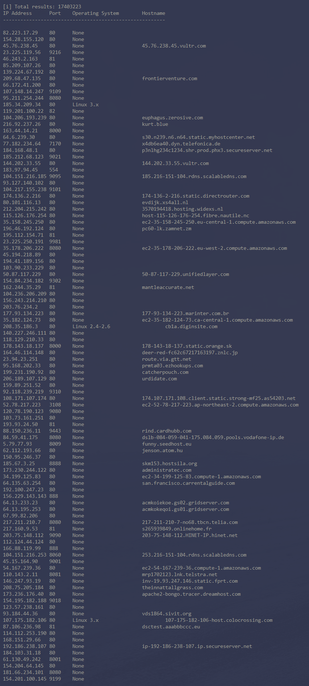
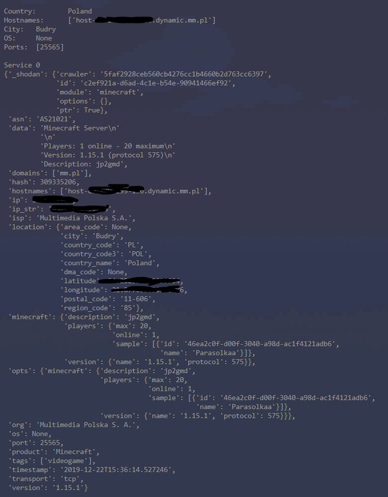

# Shodan Scanner

## Requirements
- python **3.8** or later
- [shodan-python](https://github.com/achillean/shodan-python)
- [requests](https://requests.readthedocs.io/en/master/)

## Usage
### With pipenv
```bash
pipenv run src/main.py
```
### Without pipenv
```bash
pip install -r requirements.txt
python src/main.py
```
## Screenshots



### Made by Emilian **SynneK** Zawrotny